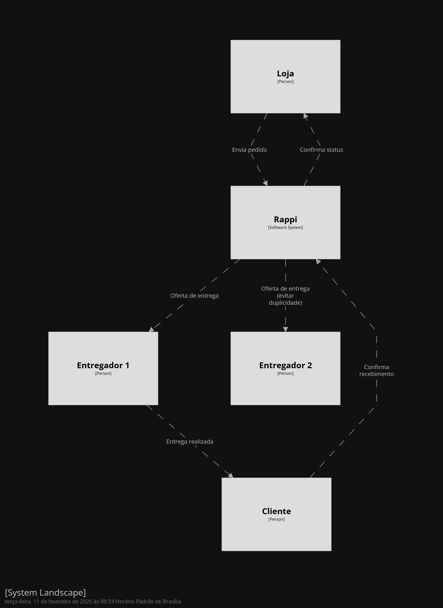
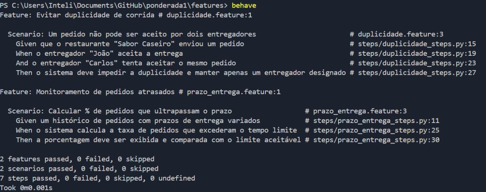

# Mapa de Business Drivers  

&emsp;&emsp;O objetivo deste repositório é apresentar o mapa de Business Drivers para pedidos no app dos entregadores da Rappi. Os seguintes direcionadores de negócio foram considerados:  

- Evitar a duplicidade de corrida, garantindo que um pedido seja aceito por apenas um entregador.  
- A taxa de pedidos que ultrapassam o prazo de entrega deve ser <= 30%.

&emsp;&emsp;O mapa foi criado utilizando a ferramenta Structurizr com o seguinte código:  

```plaintext
workspace "Rappi Entregas" "Mapa dos Business Drivers para o app dos entregadores." {

    model {
        loja = person "Loja"
        rappi = softwareSystem "Rappi"
        entregador1 = person "Entregador 1"
        entregador2 = person "Entregador 2"
        cliente = person "Cliente"

        loja -> rappi "Envia pedido"
        rappi -> entregador1 "Oferta de entrega"
        rappi -> entregador2 "Oferta de entrega (evitar duplicidade)"
        entregador1 -> cliente "Entrega realizada"
        rappi -> loja "Confirma status"
        cliente -> rappi "Confirma recebimento"
    }
    
}

<div align="center">
  <sub>Figura 1 - Diagrama </sub>
  
  <sup>Fonte: O autor (2025)</sup>
</div>
```

# Estratégia e Massa de Testes

&emsp;&emsp;A estratégia de testes para o mapa de Business Drivers foi baseada em testes de aceitação, utilizando a linguagem Gherkin e a biblioteca Behave em Python. Os testes foram estruturados no padrão Given-When-Then para garantir que o sistema respeita as regras de negócio.

&emsp;&emsp;Os testes podem ser encontrados no diretório features, nos arquivos duplicidade.feature e prazo_entrega.feature.

Para rodá-los, basta executar os seguintes comandos:
;
```bash
# Instalar o Behave
pip install behave

# Rodar os testes
cd features
behave
```
O output dos testes será semelhante ao seguinte exemplo:

<div align="center">
  <sub>Figura 2 - Output </sub>
  
  <sup>Fonte: O autor (2025)</sup>
</div>


